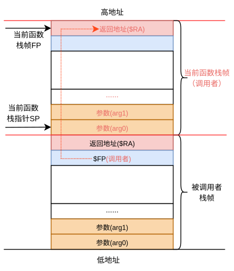
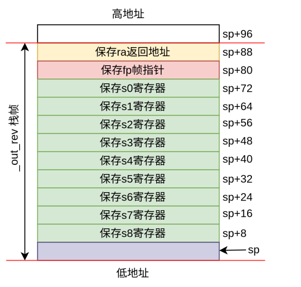
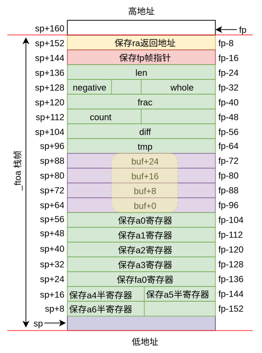

# C语言与机器类型


## 数据类型

下面是LP64对应的数据模型，涉及到的ABI类型：lp64d，lp64f，lp64s

|标量类型|机器类型|对应的位宽|
|-|-|-|
|bool / _Bool                   |Unsigned byte                | 8-bits |
|unsigned char / char           |Unsigned / signed byte       | 8-bits |
|unsigned short / short         |Unsigned / signed half-word  | 16-bits |
|unsigned int / int             |Unsigned / signed word       | 32-bits |
|unsigned long / long           |Unsigned / signed double-word| 64-bits |
|unsigned long long / long long |Unsigned / signed double-word| 64-bits |
|pointer types                  |64-bit data pointer          | 64-bits |
|_Float16                       |Half precision (IEEE754)     | 16-bits |
|__bf16                         |Half precision (bfloat16)    | 16-bits |
|float                          |Single precision (IEEE754)   | 32-bits |
|double                         |Double precision (IEEE754)   | 64-bits |
|long double                    |Quadruple precision (IEEE754)| 128-bits|


下面是ILP32对应的数据模型，涉及到的ABI类型：ilp32d，ilp32f，ilp32s

|标量类型|机器类型|对应的位宽|
|-|-|-|
|bool / _Bool                   |Unsigned byte                | 8-bits |
|unsigned char / char           |Unsigned / signed byte       | 8-bits |
|unsigned short / short         |Unsigned / signed half-word  | 16-bits |
|unsigned int / int             |Unsigned / signed word       | 32-bits |
|unsigned long / long           |Unsigned / signed word       | 32-bits |
|unsigned long long / long long |Unsigned / signed double-word| 64-bits |
|pointer types                  |32-bit data pointer          | 32-bits |
|_Float16                       |Half precision (IEEE754)     | 16-bits |
|__bf16                         |Half precision (bfloat16)    | 16-bits |
|float                          |Single precision (IEEE754)   | 32-bits |
|double                         |Double precision (IEEE754)   | 64-bits |
|long double                    |Quadruple precision (IEEE754)| 128-bits|


## 栈帧的排布

进程执行过程中会在内存中为其分配栈空间。栈是我们最常用到的存放可读写临时数据的区域。   
通常我们会使用栈来管理函数运行过程中的返回地址、参数和局部变量等信息。     
栈的大小在程序编译后已经确定。


<!-- ```{image} ../../img/stackframe_Layout.drawio.svg
:alt: StackFrame
:class: bg-primary
:scale: 150 %
:align: center
``` -->

<!-- ```{image} ../../img/stackframe_Layout.drawio.svg
:alt: StackFrame
:scale: 150 %
:align: left
``` -->



进程执行过程中会在内存中为其分配栈空间。栈是我们最常用到的存放可读写临时数据的区域。   
通常我们会使用栈来管理函数运行过程中的返回地址、参数和局部变量等信息。     
栈的大小在程序编译后已经确定。

进程执行过程中会在内存中为其分配栈空间。栈是我们最常用到的存放可读写临时数据的区域。   
通常我们会使用栈来管理函数运行过程中的返回地址、参数和局部变量等信息。     
栈的大小在程序编译后已经确定。

---------------------------------------------

### 示例代码

ftoa函数是C语言标准库中的一个函数，用于将浮点数转换为字符串。其原型如下：

``char *ftoa(double value, int precision);``

下面的代码是我们截取了部分代码，作为说明栈的排布情况。

```c
// output the specified string in reverse, taking care of any zero-padding
static size_t _out_rev(out_fct_type out, char* buffer, size_t idx, 
	                   size_t maxlen, const char* buf, size_t len, 
	                   unsigned int width, unsigned int flags)
{
  const size_t start_idx = idx;

  // pad spaces up to given width
  if (!(flags & FLAGS_LEFT) && !(flags & FLAGS_ZEROPAD)) {
    for (size_t i = len; i < width; i++) {
      out(' ', buffer, idx++, maxlen);
    }
  }

  // reverse string
  while (len) {
    out(buf[--len], buffer, idx++, maxlen);
  }

  // append pad spaces up to given width
  if (flags & FLAGS_LEFT) {
    while (idx - start_idx < width) {
      out(' ', buffer, idx++, maxlen);
    }
  }

  return idx;
}
```

我们先分析_out_rev函数的栈帧布局。

```
_out_rev():
   c:	02fe8063 	addi.d      	$sp, $sp, -96
  10:	29c14076 	st.d        	$fp, $sp, 80
  14:	29c12077 	st.d        	$s0, $sp, 72
  18:	29c0e079 	st.d        	$s2, $sp, 56
  1c:	29c0c07a 	st.d        	$s3, $sp, 48
  20:	29c0a07b 	st.d        	$s4, $sp, 40
  24:	29c0807c 	st.d        	$s5, $sp, 32
  28:	29c0607d 	st.d        	$s6, $sp, 24
  2c:	29c0407e 	st.d        	$s7, $sp, 16
  30:	29c0207f 	st.d        	$s8, $sp, 8
  34:	29c16061 	st.d        	$ra, $sp, 88
  38:	29c10078 	st.d        	$s1, $sp, 64

  3c:	03400d6c 	andi        	$t0, $a7, 0x3
  40:	001500da 	move        	$s3, $a2
  44:	001500bb 	move        	$s4, $a1
  48:	00150099 	move        	$s2, $a0
  4c:	001500fc 	move        	$s5, $a3
  50:	0015011d 	move        	$s6, $a4

  54:	00150137 	move        	$s0, $a5
  58:	00150156 	move        	$fp, $a6
  5c:	0340097e 	andi        	$s7, $a7, 0x2

  60:	001500df 	move        	$s8, $a2
  64:	4000cd80 	beqz        	$t0, 204	# 130 <L0^A>
  68:	03400000 	nop

  6c:	0010feff 	add.d       	$s8, $s0, $s8
  70:	03400000 	nop
  74:	03400000 	nop
  78:	03400000 	nop
  7c:	0011dfe6 	sub.d       	$a2, $s8, $s0
  80:	02fffef7 	addi.d      	$s0, $s0, -1

  84:	38005fa4 	ldx.b       	$a0, $s6, $s0
  88:	00150387 	move        	$a3, $s5
  8c:	00150365 	move        	$a1, $s4
  90:	001503f8 	move        	$s1, $s8
  94:	4c000321 	jirl        	$ra, $s2, 0

  98:	47ffe6ff 	bnez        	$s0, -28	# 7c <L0^A>
  9c:	400043c0 	beqz        	$s7, 64	# dc <L0^A>
  a0:	0011ebfa 	sub.d       	$s3, $s8, $s3
  a4:	00df02d7 	bstrpick.d  	$s0, $fp, 0x1f, 0x0
  a8:	6c003757 	bgeu        	$s3, $s0, 52	# dc <L0^A>
  ac:	03400000 	nop
  b0:	03400000 	nop
  b4:	03400000 	nop

  b8:	00150306 	move        	$a2, $s1
  bc:	00150387 	move        	$a3, $s5
  c0:	00150365 	move        	$a1, $s4
  c4:	02808004 	li.w        	$a0, 32
  c8:	02c0075a 	addi.d      	$s3, $s3, 1
  cc:	02c00718 	addi.d      	$s1, $s1, 1
  d0:	4c000321 	jirl        	$ra, $s2, 0
  d4:	6bffe757 	bltu        	$s3, $s0, -28	# b8 <L0^A>
  d8:	03400000 	nop

  dc:	28c16061 	ld.d        	$ra, $sp, 88
  e0:	28c14076 	ld.d        	$fp, $sp, 80
  e4:	28c12077 	ld.d        	$s0, $sp, 72
  e8:	28c0e079 	ld.d        	$s2, $sp, 56
  ec:	28c0c07a 	ld.d        	$s3, $sp, 48
  f0:	28c0a07b 	ld.d        	$s4, $sp, 40
  f4:	28c0807c 	ld.d        	$s5, $sp, 32
  f8:	28c0607d 	ld.d        	$s6, $sp, 24

  fc:	28c0407e 	ld.d        	$s7, $sp, 16
 100:	28c0207f 	ld.d        	$s8, $sp, 8
 104:	00150304 	move        	$a0, $s1
 108:	28c10078 	ld.d        	$s1, $sp, 64
 10c:	02c18063 	addi.d      	$sp, $sp, 96
 110:	4c000020 	ret
```

栈分布如下所示：




----------------------------------


```c
// internal ftoa for fixed decimal floating point
static size_t _ftoa(out_fct_type out, char* buffer, size_t idx, 
	                size_t maxlen, double value, unsigned int prec, 
	                unsigned int width, unsigned int flags)
{
  char buf[PRINTF_FTOA_BUFFER_SIZE];
  size_t len  = 0U;
  double diff = 0.0;

  // powers of 10
  static const double pow10[] = { 1, 10, 100, 1000, 10000, 100000, 
                                 1000000, 10000000, 100000000, 1000000000 };

  // test for special values
  if (value != value)
    return _out_rev(out, buffer, idx, maxlen, "nan", 3, width, flags);
  if (value < -DBL_MAX)
    return _out_rev(out, buffer, idx, maxlen, "fni-", 4, width, flags);
  if (value > DBL_MAX)
    return _out_rev(out, buffer, idx, maxlen, (flags & FLAGS_PLUS) ? "fni+" : "fni", (flags & FLAGS_PLUS) ? 4U : 3U, width, flags);

  // 省略部分代码

  if (diff > 0.5) {
    ++frac;
    // handle rollover, e.g. case 0.99 with prec 1 is 1.0
    if (frac >= pow10[prec]) {
      frac = 0;
      ++whole;
    }
  }
  else if (diff < 0.5) {
  }
  else if ((frac == 0U) || (frac & 1U)) {
    // if halfway, round up if odd OR if last digit is 0
    ++frac;
  }

  // do whole part, number is reversed
  while (len < PRINTF_FTOA_BUFFER_SIZE) {
    buf[len++] = (char)(48 + (whole % 10));
    if (!(whole /= 10)) {
      break;
    }
  }

  // 省略部分代码

  if (len < PRINTF_FTOA_BUFFER_SIZE) {
    if (negative) {
      buf[len++] = '-';
    }
    else if (flags & FLAGS_PLUS) {
      buf[len++] = '+';  // ignore the space if the '+' exists
    }
    else if (flags & FLAGS_SPACE) {
      buf[len++] = ' ';
    }
  }

  return _out_rev(out, buffer, idx, maxlen, buf, len, width, flags);
}

```


```
0000000000000000 <_ftoa>:
_ftoa():
   0:	02fd8063 	addi.d      	$sp, $sp, -160
   4:	29c26061 	st.d        	$ra, $sp, 152
   8:	29c24076 	st.d        	$fp, $sp, 144
   c:	02c28076 	addi.d      	$fp, $sp, 160

0000000000000010 <L0^A>:
  10:	29fe62c4 	st.d        	$a0, $fp, -104
  14:	29fe42c5 	st.d        	$a1, $fp, -112
  18:	29fe22c6 	st.d        	$a2, $fp, -120
  1c:	29fe02c7 	st.d        	$a3, $fp, -128
  20:	2bfde2c0 	fst.d       	$fa0, $fp, -136
  24:	0015010c 	move        	$t0, $a4
  28:	0015012e 	move        	$t2, $a5
  2c:	0015014d 	move        	$t1, $a6
  30:	29bdd2cc 	st.w        	$t0, $fp, -140
  34:	001501cc 	move        	$t0, $t2
  38:	29bdc2cc 	st.w        	$t0, $fp, -144
  3c:	001501ac 	move        	$t0, $t1
  40:	29bdb2cc 	st.w        	$t0, $fp, -148
  44:	29ffa2c0 	st.d        	$zero, $fp, -24
  48:	29ff22c0 	st.d        	$zero, $fp, -56
  4c:	293f9ec0 	st.b        	$zero, $fp, -25
  50:	2bbde2c0 	fld.d       	$fa0, $fp, -136
  54:	0114a801 	movgr2fr.d  	$fa1, $zero
  58:	0c218400 	fcmp.slt.d  	$fcc0, $fa0, $fa1
  5c:	48001c00 	bceqz       	$fcc0, 28	# 78 <.L2>
  60:	0280040c 	li.w        	$t0, 1
  64:	293f9ecc 	st.b        	$t0, $fp, -25
  68:	0114a801 	movgr2fr.d  	$fa1, $zero
  6c:	2bbde2c0 	fld.d       	$fa0, $fp, -136
  70:	01030020 	fsub.d      	$fa0, $fa1, $fa0
  74:	2bfde2c0 	fst.d       	$fa0, $fp, -136

  // 省去部分代码

0000000000000560 <.L39>:
 560:	28bdb2cc 	ld.w        	$t0, $fp, -148
 564:	0340218c 	andi        	$t0, $t0, 0x8
 568:	0040818c 	slli.w      	$t0, $t0, 0x0
 56c:	40002180 	beqz        	$t0, 32	# 58c <.L37>
 570:	28ffa2cc 	ld.d        	$t0, $fp, -24
 574:	02c0058d 	addi.d      	$t1, $t0, 1
 578:	29ffa2cd 	st.d        	$t1, $fp, -24
 57c:	02ffc18c 	addi.d      	$t0, $t0, -16
 580:	0010d98d 	add.d       	$t1, $t0, $fp
 584:	0280800c 	li.w        	$t0, 32
 588:	293ec1ac 	st.b        	$t0, $t1, -80

000000000000058c <.L37>:
 58c:	24ff6ecd 	ldptr.w     	$t1, $fp, -148
 590:	24ff72cc 	ldptr.w     	$t0, $fp, -144
 594:	02fe82ce 	addi.d      	$t2, $fp, -96
 598:	001501ab 	move        	$a7, $t1
 59c:	0015018a 	move        	$a6, $t0
 5a0:	28ffa2c9 	ld.d        	$a5, $fp, -24
 5a4:	001501c8 	move        	$a4, $t2
 5a8:	28fe02c7 	ld.d        	$a3, $fp, -128
 5ac:	28fe22c6 	ld.d        	$a2, $fp, -120
 5b0:	28fe42c5 	ld.d        	$a1, $fp, -112
 5b4:	28fe62c4 	ld.d        	$a0, $fp, -104
 5b8:	54000000 	bl          	0	# 5b8 <.L37+0x2c>
 5bc:	0015008c 	move        	$t0, $a0
 5c0:	00150184 	move        	$a0, $t0
 5c4:	28c26061 	ld.d        	$ra, $sp, 152

00000000000005c8 <L0^A>:
 5c8:	28c24076 	ld.d        	$fp, $sp, 144
 5cc:	02c28063 	addi.d      	$sp, $sp, 160
 5d0:	4c000020 	ret
```

栈分布如下所示：




