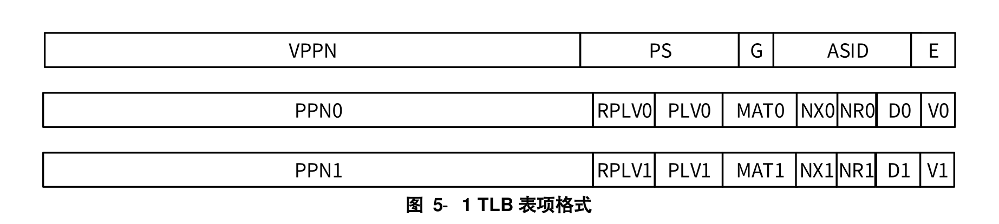

# LoongArch的地址管理

龙芯架构中虚拟地址空间是线性平整的。在LoongArch64架构下，2{sup}`64`字节的空间**并不都是合法的**，下面实际说明：

1. **物理地址空间**    

在LoongArch64下，内存的物理地址范围[0, 2{sup}`PALEN`-1]

其中，可以使用指令cpucfg读取配置字0x1的PALEN域来确定具体的值

```asm
li.w     $t0, 0x1
cpucfg   $t1, $t0  # $t1保存读取的配置字， $t1[11:4]的值是：所支持的物理地址位数的值减1
```

2. **虚拟地址空间**

- 当CPU复位的时候，也就是CSR.CRMD[^csr_note_explain]的 ``DA=1 && PG=0``    
  此时，物理地址默认等于 ``PA[PALEN-1:0] = VA[PALEN-1:0]``    
   (PA: Physical Address, 物理地址)，(VA: Virtual Address，虚拟地址)    


- 当CPU使能映射地址模式: 也就是CSR.CRMD的``DA=0 && PG=1``时，   
  VA虚拟地址有效宽度是VALEN，此时可以通过``cpucfg``指令读取配置字0x1的[19:12]位，表示所支持的虚拟地址位数减1

  当采用页表映射时，虚拟地址最高位必须满足VA[63:VALEN] = SigExt(VA[VALEN-1])，即符号位扩展。如果不满足则生成地址错误异常。

  比如：我现在CPU最大支持的虚拟地址是48位，则VALEN=48。
  如果VA[63:48] =/= {17{VA[47]}}，则会报错！

  注意在CPU复位的时候，是不需要进行这种非法性检查。


[^csr_note_explain]: CSR.CRMD表示是CSR寄存器中的CRMD寄存器，后续我们描述控制与状态寄存器的某一个寄存器XXX时，都使用CSR.XXX的方式。


## 直接地址翻译模式
LoongArch的直接映射地址翻译模式是一个比较特殊的映射模式，相比于其他的架构X86，ARM，RISC-V等。它是将一个很大的虚拟地址空间
线性的映射到了一个同等大小的物理空间（这里并没有要求这个物理地址空间都存在）。

当CSR.CRMD的``DA=0 && PG=1``时， 如果再配置了CSR.DMW0-CSR.DMW3寄存器，则可以使用此模式翻译。

也就是说，CPU复位以后，我们必须手动的设置CRMD，才能使用此模式的寄存器。复位情况下，是不能使用的。

具体的使用方法与说明我们详细看[DMW章节](#csr-dmw)

## 映射地址翻译模式

在映射地址翻译的模式下，除了上述说明的**直接地址翻译模式**外，就是我们经常所说的页式管理机制，将内存划分为页大小的块，
然后通过TLB转换获得虚拟地址到物理地址的转换。然后才能实际访问对应物理地址的内存。


## 存储访问的类型

LoongArch支持三种存储访问类型：
  - 一致性可缓存： Coherent Cached，主要是用于我们正常的内存访问
  - 强序非缓存：Strong-ordered UnCached，主要是用于一些设备空间
  - 弱序非缓存：Weakly-ordered UnCached，不常用

下面我们简称 CSR.CRMD的``DA=1 && PG=0``时 为关闭MMU， CSR.CRMD的``DA=0 && PG=1``时 为打开MMU，

> 1. 当**CPU复位的**时候，此时CSR.CRMD的``DA=1 && PG=0``时, CSR.CRMD寄存器管理
>    - 取指令的访问类型：由CSR.CRMD.DATF决定
>    - 当其他load/store指令时的访问类型：由CSR.CRMD.DATM决定

> 2. 当**打开MMU时**，即``DA=0 && PG=1``，
>    - 此时如果地址落在了DMW内，则此时的访问类型由命中的DWMX.MAT域来决定。
>    - 如果地址落在了页表管理的页内，则此时由页表表项的[5:4]也就是MAT来管理。


:::{tip}
如果我们设置了一个地址A，然后这个地址既落在了DMW内，也有相应的页表映射，此时我们以DMW为主。    
也就是说CPU首先访问DMW，返回如果命中的话，就不会再去查找TLB了。
:::


:::{error}
CSR.CRMD的DA和PG的可能组合是``DA=1 && PG=0`` 或者``DA=0 && PG=1``，    
其他的组合情况，处理器的行为不确定，因此需要特殊注意！
:::


## 操作系统如何选择

假设我们CPU上电后，操作权限交给了Kernel，此时我们还是运行在物理地址0x200000，此时虚拟地址等于物理地址。

下面我们会示例介绍几种kernel使用的场景和初始化的方式。供操作系统使用，既可以单独使用，也可以组合使用。

1. **步骤1**： 操作系统Kernel在CPU上电的时候，此时CPU处于**直接地址翻译模式**, 此时``DA=0 && PG=1``

   此时CPU的地址模式是： 虚拟地址等于物理地址，VA = PA。

   此时访问内存的类型，通过CSR.CRMD的DATF和DATM决定。

   可以设置 CSR.CRMD.DATF = 2'b01，这时**CPU取指的路径**通过Cache读取（如果Cache缺失，在访问内存），    
   如果不设置也就是默认 CSR.CRMD.DATF = 2'b00，指令从内存中读取，不经过Cache。

   通用设置CSR.CRMD.DATM = 2'b01，这是访存指令load/store也是通过Cache读取数据，    
   如果不设置也就是默认 ``CSR.CRMD.DATM = 2'b00``，数据直接从内存读取或者写回，不经过Cache。


2. **步骤2**： 如果Kernel(此时CPU还是处于直接地址翻译模式)想要使用**直接映射模式**，需要做一些初始化的工作
为使能直接映射模式（DMW方式）做准备。

   主要操作如下：
   - 初始化相关DMW[x]寄存器，比如下面所示：
      假设我们的Kernel运行在0x9000xxxxxxxxxxxxxxxx的地址上
      ```asm 
      li.d  $t0, 0x9000000000000011
      csrwr $t0, 0x180 // 设置DMW0， PLV0，Cache
      ```
   - 确认当前的PC是运行在0x9000xxxxxxxxxxxxxxxx上，如果没有需要跳转到此地址去。
     如下所示：
     ```asm
     // 首先将虚拟地址的基址加载到寄存器t0上。
     li.d   $t0, 0x9000000000000000
     
     // 将当前指令的地址加载到寄存器t1上
     pcaddi $t1, 0

     // 将上一条指令的地址t1，加上基址t0，再赋值到t0，此时
     // t0保存着上一条指令的地址（加上了虚拟地址偏移）
     or     $t0, $t0, $t1

     // 此时我们需要跳转到上面pcaddi地址加C的位置，也就是隔了三条指令，
     // 如果pcaddi指令的地址，加上三条指令，正好是下条指令的地址，也就真好跳转到新的地址上了。
     jirl   $zero, $t0, 0xc
     ```

   - 此时，我们已经准备好了虚拟地址，下一步就是打开CSR.CRMD寄存器的配置
     ```asm
     // PLV=0, IE=0, DA=0, PG=1
     li.w   $t0, 0xb0  
     csrwr  $t0, 0x0
     ```
     此时我们已经工作在**直接映射模式**，注意此时我们还是在使用DMW，并没有开启页表映射的相关机制。

     如果想要开启页表的机制**页表映射模式**，可以初始化相关的寄存器，初始化TLB寄存器后，
     就可以使用页表映射来进行虚实地址转换了。

3. **步骤3**： 如果不想使用步骤2的直接映射模式，想直接进入**页表映射模式**，也是可以的。    
   此时，我们需要做的事情如下所示： （CPU目前处于``DA=0 && PG=1``， 直接地址翻译模式）    
   假设我们的虚拟地址是0xffff_fxxx_xxxx_xxxx，到物理地址xxx_xxxx_xxxx的映射。      
   - 将我们的物理地址跳转到目标的虚拟地址
      ```asm
      // 注意此时加载的虚拟地址偏移可根据实际情况来设置！
      li.d   $t0, 0xfffff00000000000
      pcaddi $t1, 0
      or     $t0, $t0, $t1
      jirl   $zero, $t0, 0xc
      ```
      此时CPU之所以能够正常运行是因为，LoongArch的直接地址模式会自动截断，比如``0xfffff00000208000``    
      这个地址，会自动截断为``0x208000``，这个和别的架构有些不一样，需要注意！
   
   - 此时我们需要我们需要准备初始化我们的TLB寄存器，
     比如设置PGDL和PGDH，以及PWCL和PWCH等等，这个我们会在后续的章节详细说明。

   - 设置页表映射关系，也就是页表内容，此时需要将内核执行的地址空间全部映射，因为我们可能
     还没有初始化页表异常处理程序。

   - 接着还是设置CSR.CRMD的DA和PG``DA=0 && PG=1``

   - 此时我们就执行在**页表映射模式**下，所有的虚拟地址的转换，都是通过页表来翻译。


:::{tip}
从上面的初始化步骤可以看出，步骤1是我们必须存在的过程。后面，我们可能只选择直接地址翻译模式，或者直接使用页表映射模式
或者两者都同时存在。

一般，在kernel刚获得执行权后，我们会初始化直接使用**直接地址翻译模式**，后续再如果有需要我们再设置页表映射模式。
这样kernel在后续内核态的时候直接使用DMW，而不用进行页表映射，极大的加速了访问（因为页表映射模式还要访问TLB，可能还要访问内存等），而且操作方便简单！

或者对于熟悉**页表映射模式**的开发者，可以不用DMW的方式，直接按照步骤三的方式，初始化页表TLB相关内容，直接使用页表翻译虚实地址。
都是可以的。

比如，Linux就是使用**直接地址翻译模式**和**页表映射模式**，而一些简单的嵌入式内核，只有一种特权模式，可以使用**直接地址翻译模式**来处理。
:::

<!-- 1. 直接虚拟地址对应与物理地址
2. 初始化内核空间用DMW管理
3. 对于用户的空间，使用页表管理，禁止使用DMW
4. 内核空间的选择
   - 选择DMW的好处
   - 选择页表管理的好处
 -->


# LoongArch的TLB结构
本章节我们来介绍龙架构下的TLB的结构。

## 逻辑组织结构
LoongArch的TLB主要份两部分组成，一个是STLB，另一个是MTLB。下面详细介绍：

1. STLB（singular-Page-Size TLB）：从名字就可以看出其功能，
 
   STLB中的表项的页大小都是固定的，其大小可以通过CSR.STLBPS来设置。

2. MTLB (Multiple-Page-Size TLB): 存放的是页大小不一致的页表映射。


:::{tip}
**STLB**由于其只保存相同页大小的页表项，因此采用多路组相连的组织方式，一般容量比较大。比如2048项，分成8个组等。

>> 硬件查询STLB的时候，假设有组的个数为WAY，每组的大小为SET，索引为INDEX，PAGE_SIZE为页大小，他们的关系如下：

>> STLB大小 = WAY * SET，SET = 2{sup}INDEX PAGE_SIZE = 2{sup}PS 

>> 索引index的计算方法： INDEX=VA[PS+LOG2(SET): PS+1]


**MTLB**保存多个页大小的表项，通常采用全相连的组织方式。全相连一般查询延迟比较大，因此容量比较小，通常为32或者64项等。

:::

## TLB的表项（以CPU的视觉）
硬件自动管理，无需过多的操作。

<!--  -->

每一个 TLB 表项的格式如图所示，包含两个部分：**比较部分**和**物理转换部分**。

```{image} ../../img/tlb_struct.png
:alt: TLB Struct
:class: bg-primary
:scale: 50 %
:align: center
```
<!-- center, left, right -->


TLB 表项的**比较部分**包括：
 - ❖存在位(E)，1 比特。为 1 表示所在 TLB 表项非空，可以参与查找匹配。    
 -----
 - ❖地址空间标识(ASID)，10 比特。地址空间标识用于区分不同进程中的同样的虚地址，避免进程切    
    换时清空整个 TLB 所带来的性能损失。操作系统为每个进程分配唯一的 ASID，TLB 在进行查找     
    时除了比对地址信息一致外，还需要比对 ASID 信息。   
 -----
 - ❖全局标志位(G)，1 比特。当该位为 1 时，查找时不进行 ASID 是否一致性的检查。当操作系统需要      
    在所有进程间共享同一虚拟地址时，可以设置 TLB 页表项中的 G 位置为 1。   
 -----
 - ❖页大小(PS)，6 比特。仅在 MTLB 中出现。用于指定该页表项中存放的页大小。数值是页大小的 2    
    的幂指数。即对于 16KB 大小的页，PS=14。
 -----
 - ❖虚双页号(VPPN)，(VALEN-13)比特。在龙芯架构中，每一个页表项存放了相邻的一对奇偶相邻页    
    表信息，所以 TLB 页表项中存放虚页号的是系统中虚页号/2 的内容，即虚页号的最低位不需要存     
    放在 TLB 中。查找 TLB 时在根据被查找虚页号的最低位决定是选择奇数号页还是偶数号页的物理    
    转换信息。    
 -----

表项的**物理转换部分**存有一对奇偶相邻页表的物理转换信息，每一个页的转换信息包括：       
 - ❖有效位(V)，1 比特。为 1 表明该页表项是有效的且被访问过的。
-----   
 - ❖脏位(D)，1 比特。为 1 表示该页表项项所对应的地址范围内已有脏数据。
 -----
 - ❖不可读位(NR)，1 比特。为 1 表示该页表项所在地址空间上不允许执行 load 操作。该控制位仅定       
    义在 LA64 架构下。
 ----- 
 - ❖不可执行位(NX)，1 比特。为 1 表示该页表项所在地址空间上不允许执行取指操作。该控制位仅定    
    义在 LA64 架构下。
 ----- 
 - ❖存储访问类型(MAT)，2 比特。控制落在该页表项所在地址空间上访存操作的存储访问类型。各数
    值具体含义见 5.3 节。
 ----- 
 - ❖特权等级（PLV），2 比特。该页表项对应的特权等级。当 RPLV=0 时，该页表项可以被任何特权        
    等级不低于 PLV 的程序访问；当 RPLV=1 时，该页表项仅可以被特权等级等于 PLV 的程序访问。
 ----- 
 - ❖受限特权等级使能（RPLV），1 比特。页表项是否仅被对应特权等级的程序访问的控制位。请参     
    看上面 PLV 中的内容。该控制位仅定义在 LA64 架构下。
 ----- 
 - ❖物理页号(PPN)，(PALEN-12)比特。当页大小大于 4KB 的时候，TLB 中所存放的 PPN 的[PS-1:12]
    位可以是任意值。


# TLB的管理

## TLB的一些概念区分

主要是，什么是tlb重填(tlbrefill)，我们现在那些支持这项功能，
怎么动态的区分（使用cpucfg指令）。

什么是ptw，为什么存在硬件hptw，现在的那些平台支持hptw

TLB和地址转换是什么关系?


## TLB相关的指令

TLB 相关的指令主要涉及对 TLB 的查找、读、写、无效等操作，用于进行 TLB 的填充、更新与一致性   
维护。具体的指令定义请参看本手册 4.2.4 节和 4.2.5 节中的内容。

- TLBSRCH

- TLBRD

- TLBWR
- TLBFILL
- TLBCLR
- TLBFLUSH
- INVTLB

- LDDIR
- LDPTE


## TLB相关的CSR

TLB 相关的 CSR 按照功能主要分为三类，
1. 第一类用于非 TLB 重填例外情况下 TLB 的交互接口，
2. 第二类用于软硬件页表遍历，
3. 第三类用于 TLB 重填例外。

**第一类包括**：
   - ❖BADV
   - ❖TLBEHI
   - ❖TLBELO0
   - ❖TLBELO1
   - ❖TLBIDX
   - ❖ASID
   - ❖STLBPS

**第二类包括**：
   - ❖PGDL
   - ❖PGDH
   - ❖PGD
   - ❖PWCL
   - ❖PWCH

**第三类包括**：
   - ❖TLBRENTRY
   - ❖TLBRERA
   - ❖TLBRBADV
   - ❖TLBREHI
   - ❖TLBRELO0
   - ❖TLBRELO1
   - ❖TLBRPRMD
   - ❖TLBRSAVE
上述各 CSR 寄存器与 TLB 交互的细节，请参考 7.4 节中各 CSR 的详细定义

## TLB相关的例外


TLB 进行虚实地址转换过程由硬件自动完成，但是当 TLB 中没有匹配项，或者尽管匹配但页表项无效     
或访问非法时，就需要触发例外，交由操作系统内核或其它监管程序，由软件进一步处理，对 TLB 的内容    
进行维护，或对程序执行的合法性做最后裁定。

龙芯架构中与 TLB 管理相关的例外有：

--------
- ❖ TLB 重填例外：当访存操作的虚地址在 TLB 中查找没有匹配项时，触发该例外，通知系统软件进    
行 TLB 重填工作。该例外拥有独立的例外入口、独立的用于维护例外现场的 CSR 以及一套独立的    
TLB 访问接口 CSR，意味着该例外允许在其它例外的处理过程中被触发。TLB 重填例外陷入的同    
时，硬件会自动将 CSR.CRMD 的 DA 置为 1，PG 置为 0，即自动进入直接地址翻译模式，从而避    
免 TLB 重填例外处理程序自身再次触发 TLB 重填例外，此时例外现场将无法保存与恢复。为了区     
分 TLB 重填例外陷入后所使用的 CSR 和其它例外可使用的 CSR，TLB 重填例外陷入的同时，硬    
件还会自动将 CSR.TLBRERA.ISTLBR 位置 1。
--------
- ❖ load 操作页无效例外：load 操作的虚地址在 TLB 中找到了匹配项但是匹配页表项的 V=0，将触发    
该例外。PIL: 
--------
- ❖ store 操作页无效例外：store 操作的虚地址在 TLB 中找到了匹配项但是匹配页表项的 V=0，将触发    
该例外。PIS: 
--------
- ❖ 取指操作页无效例外：取指操作的虚地址在 TLB 中找到了匹配项但是匹配页表项的 V=0，将触发    
该例外。PIM: 
--------
- ❖ 页特权等级不合规例外：访存操作的虚地址在 TLB 中找到了匹配且 V=1 的项，但是访问的特权等   
级不合规，将触发该例外。特权等级不合规体现为，该页表项的 RPLV=0 且 CSR.CRMD.PLV 值大   
于页表项中的 PLV；或是该页表项的 RPLV=1 且 CSR.CRMD.PLV 不等于页表项中的 PLV。    
--------
- ❖ 页修改例外：store 操作的虚地址在 TLB 中找到了匹配，且 V=1，且特权等级合规的项，但是该页    
表项的 D 位为 0，将触发该例外。

:::{tip}
  在例外中设置D=1，然后返回
:::

--------
- ❖ 页不可读例外：load 操作的虚地址在 TLB 中找到了匹配，且 V=1，且特权等级合规的项，但是该    
页表项的 NR 位为 1，将触发该例外。
--------
- ❖ 页不可执行例外：取指操作的虚地址在 TLB 中找到了匹配，且 V=1，且特权等级合规的项，但是    
该页表项的 NX 位为 1，将触发该例外。


